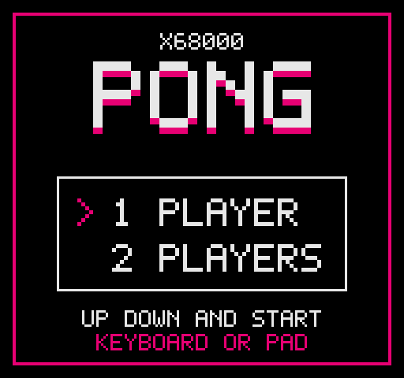

# PONG

[English](README.md) | [日本語](README.ja.md)

<p align="center">
  
</p>

<p align="center">
  <strong><a href="https://uraraworks.github.io/WebX68k/?cpu=10&ram=12&fd1=https://raw.githubusercontent.com/renatus-novus-x/pong/main/dist/pong.xdf&run=1">▶ Launch PONG in WebX68k</a></strong>
</p>

Bare-metal PONG for the Sharp X68000, written in C without Human68k runtime APIs.

## Features

- One-player mode against the CPU and local two-player mode
- Keyboard and two gamepad support
- First to three points wins, followed by a winner screen
- Famicom-inspired title screen
- A HOW TO PLAY screen explaining controls before each match

## Controls

- Player 1: `W` / `S`, or gamepad 1 up / down
- Player 2: cursor up / down, or gamepad 2 up / down
- Title: up / down and Return, Space, or gamepad A
- How to Play: Return, Space, or gamepad A to start
- `ESC`: return to the title from HOW TO PLAY or a match

## Build

Requirements: WSL Ubuntu 24.04, an installed `elf2x68k` toolchain, `python3`, and `curl`.

```sh
cd src
make
```

Build outputs:

- `src/human.sys`
- `dist/pong.xdf`

To inspect the generated XDF:

```sh
cd src
make check-xdf
```

The technical implementation report is available in [`docs/pong-en.pdf`](docs/pong-en.pdf).
